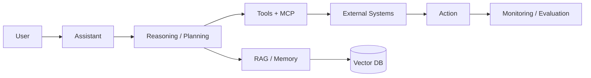

<div align="center">

<a href="https://github.com/viral3899">
  
</a>

<br>

<a href="https://github.com/viral3899">
  
</a>
<a href="https://www.linkedin.com/in/viralsherathiya">
  
</a>
<a href="https://viral3899.github.io/">
  
</a>

<br><br>

**AI/ML Engineer · Generative AI · Agentic AI · RAG · Production ML**

*I build practical AI systems that turn models into usable products.*

</div>

---

## ⚡ What I Build

| 🧠 AI Systems | 🔎 Knowledge Systems | ⚙️ Production Engineering |
|---|---|---|
| LLM applications | RAG pipelines | FastAPI / Flask |
| Multi-agent workflows | Vector search | Docker |
| LangChain / LangGraph | Qdrant / FAISS | AWS |
| Generative AI | Semantic retrieval | MLflow / DVC |
| Recommendation systems | OCR + document AI | SQL / APIs |

---

## 🎬 AI ENGINEERING — LIVE PIPELINE

<a href="https://github.com/viral3899">
  
</a>

---

## 🧩 Featured Builds

### 🎞️ Documentary Studio
**SCRIPT → TTS → PROMPTS → IMAGES → VIDEO**

An AI-assisted documentary production pipeline combining script generation, Gemini TTS, image-prompt generation, automated image generation and FFmpeg video assembly.

**Stack:** Python · Groq · Gemini · Selenium · FFmpeg · React · Node.js

---

### 🤖 JARVIS-Style AI Assistant
A modular assistant architecture designed around conversational control, tool use, computer workflows, persistent memory, RAG, MCP integrations and permission-aware execution.

**Stack:** Python · LLMs · MCP · LangGraph · RAG · FastAPI · Computer Use

---

### 🎯 Hybrid Video Recommendation System
A recommendation architecture combining two-tower embeddings, collaborative signals and vector retrieval for personalized video discovery.

**Signals include:** likes · shares · comments · watch activity · wishlist

**Stack:** TensorFlow · Python · Vector DB · SQL · Sentence Transformers

---

### ⚖️ Legal RAG QA
A retrieval-augmented legal question-answering system built around document ingestion, embeddings, vector search and grounded responses.

**Stack:** Python · Hugging Face · FAISS · RAG · NLP

---

## 🛠️ Tech Stack

<p align="center">

</p>

<p align="center">

`Python` `Pandas` `NumPy` `scikit-learn` `TensorFlow` `PyTorch`  
`LangChain` `LangGraph` `RAG` `LLM` `MCP` `Qdrant` `FAISS`  
`FastAPI` `Flask` `Docker` `AWS` `MLflow` `DVC`  
`SQL` `Power BI` `Tableau` `OCR` `ONNX` `Sentence Transformers`

</p>

---

## 📊 GitHub Command Center

<div align="center">


<br><br>


</div>

---

## 🌃 Contribution Skyline

<a href="https://github.com/viral3899">
  
</a>

---

## 🧪 Engineering Focus

```text
┌──────────────────────────────────────────────────────────────┐
│                    VIRAL // AI ENGINEER                      │
├──────────────────────────────────────────────────────────────┤
│  LLM / GENAI       ████████████████████████                  │
│  RAG               ██████████████████████                    │
│  AGENTIC AI        █████████████████████                     │
│  ML / DL           ████████████████████                      │
│  MLOps             █████████████████                         │
│  CLOUD / DEPLOY    █████████████████                         │
└──────────────────────────────────────────────────────────────┘
```

---

## 🛰️ How I Think About AI Products



---

## 🚀 Current Build Direction

- Production-grade **Generative AI**
- **Multi-agent / Agentic AI** systems
- RAG with reliable retrieval and evaluation
- AI assistants with tool calling and computer workflows
- Production ML APIs and deployment
- Automated content/document/video pipelines
- Evaluation, observability and security for AI systems

---

## 📫 Connect

<div align="center">

<a href="https://github.com/viral3899">
  
</a>

<br><br>

<a href="https://github.com/viral3899">GitHub</a> ·
<a href="https://www.linkedin.com/in/viralsherathiya">LinkedIn</a> ·
<a href="https://viral3899.github.io/">Portfolio</a>

</div>

---

<details>
<summary>🧠 Profile architecture</summary>

This profile is intentionally built as a lightweight static README.

- No JavaScript is required inside GitHub README.
- SVG assets provide the animated visual layer.
- Dynamic GitHub statistics are supplied by read-only public stats endpoints.
- Replace or add project links as individual repositories become public.
- Keep secrets, API keys and private credentials outside the repository.

</details>

<div align="center">

<sub>Built with Python, SVG, Markdown and a lot of AI engineering.</sub>

</div>
